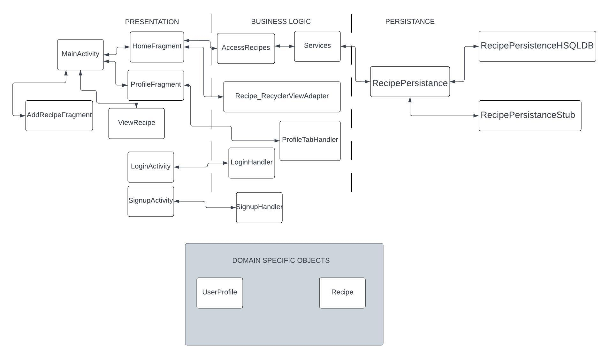

# Architecture Documentation

**Directory of Classes and their locations**

## Iteration 3 Diagram

## Presentation Layer
[SplashScreen](https://code.cs.umanitoba.ca/comp3350-winter2024/omnicode-a01-10/-/blob/61686a0f5da752d27961f2e791d63b61b19b3dde/app/src/main/java/com/pantrypro/SplashScreen.java)
- The file for splashscreen

[LoginActivity](https://code.cs.umanitoba.ca/comp3350-winter2024/omnicode-a01-10/-/blob/61686a0f5da752d27961f2e791d63b61b19b3dde/app/src/main/java/com/pantrypro/LoginActivity.java)
- The file for the log in page

[SignupActivity](https://code.cs.umanitoba.ca/comp3350-winter2024/omnicode-a01-10/-/blob/61686a0f5da752d27961f2e791d63b61b19b3dde/app/src/main/java/com/pantrypro/SignupActivity.java)
- The file for the sign up page

[MainActivity](https://code.cs.umanitoba.ca/comp3350-winter2024/omnicode-a01-10/-/blob/61686a0f5da752d27961f2e791d63b61b19b3dde/app/src/main/java/com/pantrypro/MainActivity.java)
- The file for the view for multiple pages (fragments)
    - [HomeFragment](https://code.cs.umanitoba.ca/comp3350-winter2024/omnicode-a01-10/-/blob/61686a0f5da752d27961f2e791d63b61b19b3dde/app/src/main/java/com/pantrypro/HomeFragment.java)
        - The file for the view for viewing the home page

    - [AddRecipeFragment](https://code.cs.umanitoba.ca/comp3350-winter2024/omnicode-a01-10/-/blob/61686a0f5da752d27961f2e791d63b61b19b3dde/app/src/main/java/com/pantrypro/AddRecipeFragment.java)
        - The file for the view for viewing the adding recipe page
    - [ProfileFragment](https://code.cs.umanitoba.ca/comp3350-winter2024/omnicode-a01-10/-/blob/61686a0f5da752d27961f2e791d63b61b19b3dde/app/src/main/java/com/pantrypro/ProfileFragment.java)
        - The file for the view for viewing the user profile page

[ViewRecipe](https://code.cs.umanitoba.ca/comp3350-winter2024/omnicode-a01-10/-/blob/dev/app/src/main/java/com/pantrypro/presentation/ViewRecipe.java)
- The file to display recipes

## Logic Layer
[LoginHandler](https://code.cs.umanitoba.ca/comp3350-winter2024/omnicode-a01-10/-/blob/61686a0f5da752d27961f2e791d63b61b19b3dde/app/src/main/java/com/pantrypro/LoginHandler.java)
- The main class that the presentation layer will call to validate user input and check if their account exists on the database.

[SignupHandler](https://code.cs.umanitoba.ca/comp3350-winter2024/omnicode-a01-10/-/blob/61686a0f5da752d27961f2e791d63b61b19b3dde/app/src/main/java/com/pantrypro/SignupHandler.java)
- The main class that the presentation will call to validate user input.

[Recipe_RecycleViewAdapter](https://code.cs.umanitoba.ca/comp3350-winter2024/omnicode-a01-10/-/blob/61686a0f5da752d27961f2e791d63b61b19b3dde/app/src/main/java/com/pantrypro/Recipe_RecyclerViewAdapter.java)
- The main class that the presentation will call to do display lists of recipes on home page.

[RecipeValidator](https://code.cs.umanitoba.ca/comp3350-winter2024/omnicode-a01-10/-/blob/dev/app/src/main/java/com/pantrypro/logic/RecipeValidator.java?ref_type=heads)
- A class to validate a recipe object

[AccessRecipes](https://code.cs.umanitoba.ca/comp3350-winter2024/omnicode-a01-10/-/blob/dev/app/src/main/java/com/pantrypro/logic/AccessRecipes.java?ref_type=heads)
- A file to access the recipes database 

[ProfileTabHandler](https://code.cs.umanitoba.ca/comp3350-winter2024/omnicode-a01-10/-/blob/dev/app/src/main/java/com/pantrypro/logic/ProfileTabHandler.java?ref_type=heads)
- A class that helps manage some logic encountered in the profile fragment

## Persistence Layer

### Interface
[RecipePersistance](https://code.cs.umanitoba.ca/comp3350-winter2024/omnicode-a01-10/-/blob/dev/app/src/main/java/com/pantrypro/persistence/RecipePersistence.java)
- An interface for recipe persistance, both the database used for production and the stiub used for testing implement this interface.

### Stubs
[RecipePersistanceStub](https://code.cs.umanitoba.ca/comp3350-winter2024/omnicode-a01-10/-/blob/dev/app/src/main/java/com/pantrypro/persistence/stubs/RecipePersistenceStub.java)
- A stub Recipe database implementation for testing purposes

### HSQLDB
[RecipePersistanceHSQLDB](https://code.cs.umanitoba.ca/comp3350-winter2024/omnicode-a01-10/-/blob/dev/app/src/main/java/com/pantrypro/persistence/hsqldb/RecipePersistenceHSQLDB.java?ref_type=heads)
- The recipe database used in the application

### Utils
[DBHelper](https://code.cs.umanitoba.ca/comp3350-winter2024/omnicode-a01-10/-/blob/dev/app/src/main/java/com/pantrypro/persistence/utils/DBHelper.java?ref_type=heads)
- Copy database script to local device

## Domain Specific Objects
[UserProfile](https://code.cs.umanitoba.ca/comp3350-winter2024/omnicode-a01-10/-/blob/61686a0f5da752d27961f2e791d63b61b19b3dde/app/src/main/java/com/pantrypro/UserProfile.java):
- The user profile object

[Recipe](https://code.cs.umanitoba.ca/comp3350-winter2024/omnicode-a01-10/-/blob/dev/app/src/main/java/com/pantrypro/objects/Recipe.java?ref_type=heads):
- The recipe object

[ErrorMessage](https://code.cs.umanitoba.ca/comp3350-winter2024/omnicode-a01-10/-/blob/dev/app/src/main/java/com/pantrypro/objects/ErrorMessage.java?ref_type=heads)
- A class containing error messages used arround the app
